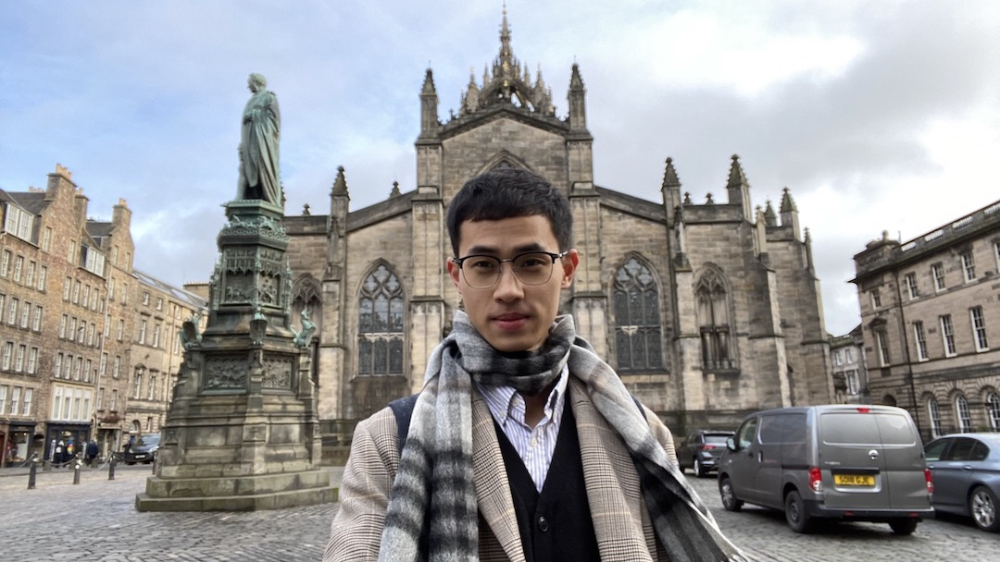
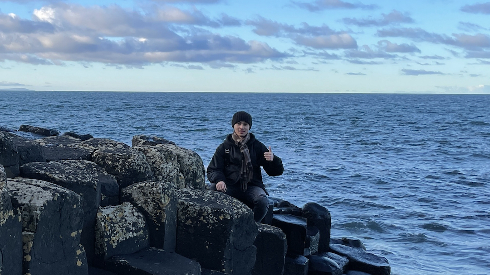
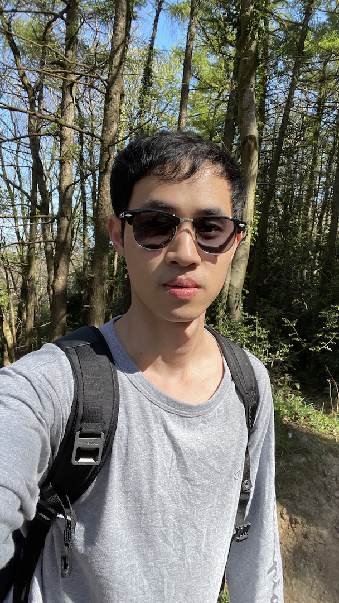
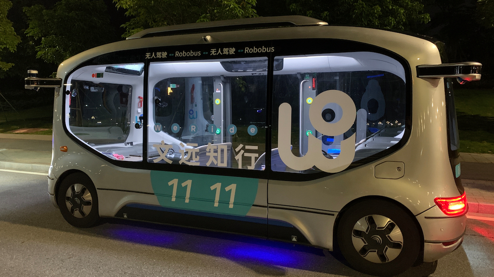
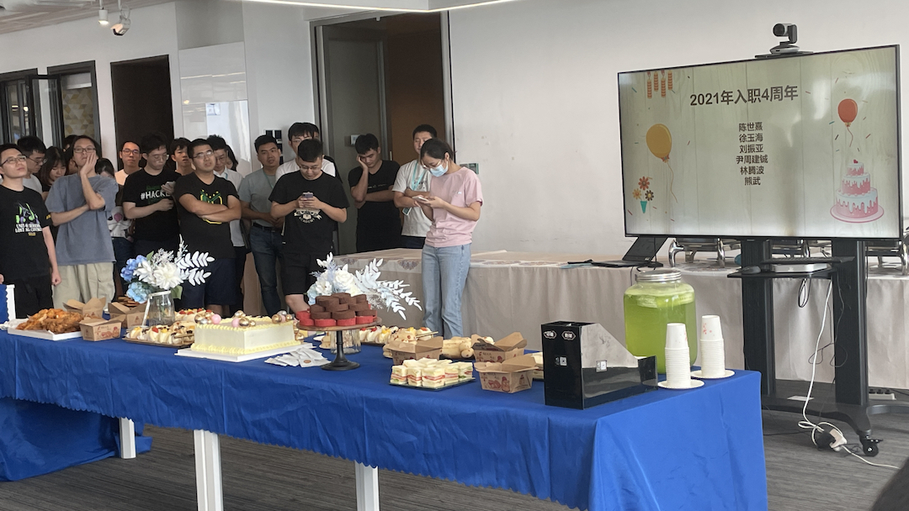
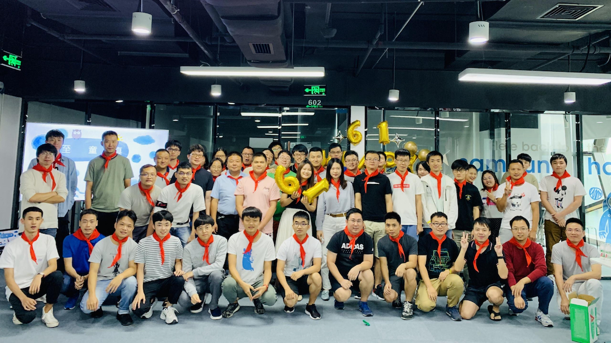
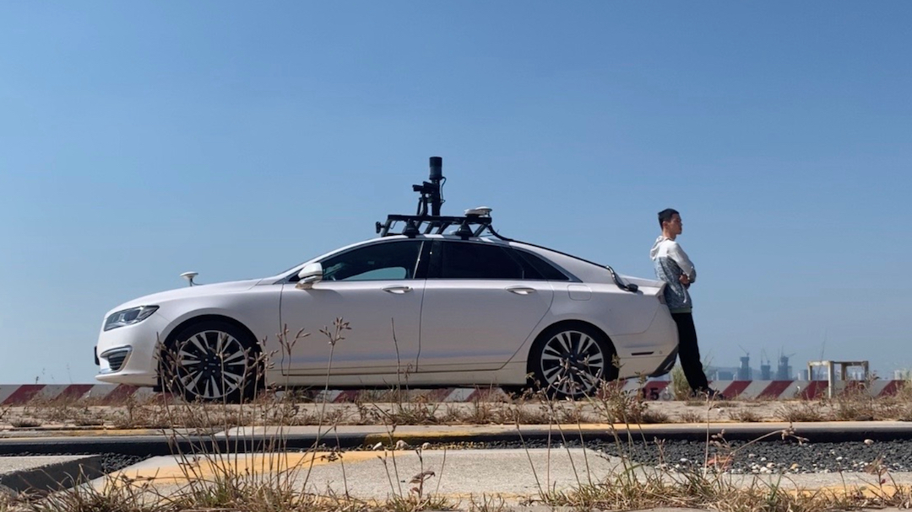

Hi!👋 I'm Wenjie(Clark) Hu, a recent computer science graduate from Maynooth University in Ireland. I'm very interested in self-driving and data science, and most of my experience is in Python and its ecosystem of tools. Other than tech, I like table tennis, hiking and cultural exchange. I currently live in Ireland.

<!-- <figure class="third">
    
</figure> -->

<!-- <figure class="third"></figure> -->

<table rules="none" align="center">
	<tr>
		<td>
			

				
				 
			

		</td>
		<td>
			

				
				 
			

		</td>
		<td>
			

				
				 
			

		</td>        
	</tr>
</table>

***

# Work 
## Production Enginner at <u>WeRide</u>, Guangzhou,China [Mar 2021 - Aug 2021]
At [WeRide](https://www.weride.ai/en/), I worked as a test-developer responsible for data analysis and high-definition map related work. There, I touched the top-level of self-driving technology in the world.
<table rules="none" align="center">
	<tr>
		<td>
			

				
				 
			

		</td>
		<td>
			

				
				 
			

		</td>
		<td>
			

				
				 
			

		</td>            
	</tr>
</table>

## Test Enginner at <u>MoonX</u>, Shenzhen,China [Dec 2018 - Mar 2021]
During my time at [MoonX](https://www.weride.ai/en/muyue-en/), I worked closely with businesses and delivered self-driving vehicles to clients. I was also responsible for autonomous vehicle road testing and data analysis. I got my hands dirty in Cyber-RT, Linux, Python, and Docker and have comprehensive knowledge of autonomous driving systems.
<table rules="none" align="center">
	<tr>
		<td>
			

				
				 
			

		</td>
		<td>
			

				
				 
			

		</td>
	</tr>
</table>

***

# Education

## A Computer Science and Engineering graduate from Maynooth University, Ireland.

- I have accomplished a Natural Language Processing project using the Stanford Parser and NLTK packages.

***

# Contact

[wenjie.hoo@outlook.com](mailto:wenjie.hoo@outlook.com)